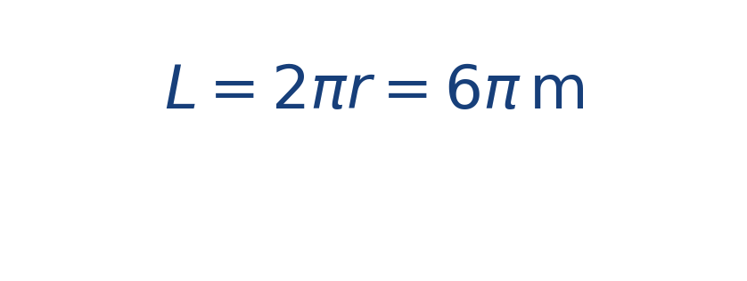

## Idea central

La circulación mide el efecto total del campo cuando recorremos una curva cerrada. Es una forma de saber si el flujo tiende a empujar alrededor del contorno.

En un remolino ideal, la circulación suele ser distinta de cero.

La idea intuitiva es recorrer la curva preguntando, en cada tramo, cuánto ayuda o se opone el campo al movimiento tangencial. La suma acumulada de esos aportes da la circulación.

## Ejercicio resuelto

**Problema.** Sobre una circunferencia de radio [[MATHIMG:math/inline_c24bd59f54d7.png|3\,\text{m}]] actúa un campo tangencial ideal de magnitud constante [[MATHIMG:math/inline_265fb103c2b6.png|2\,\text{m/s}]].

**Solución.** La longitud del contorno es

Como el campo es tangencial y constante,

## Qué observar en la simulación

Carga un flujo rotacional y recorre mentalmente una curva cerrada alrededor del centro. Ahí aparece la idea de circulación acumulada.

## Dónde se usa

Se emplea en fluidos, aerodinámica, cálculo vectorial y formulaciones introductorias de teoremas integrales.
