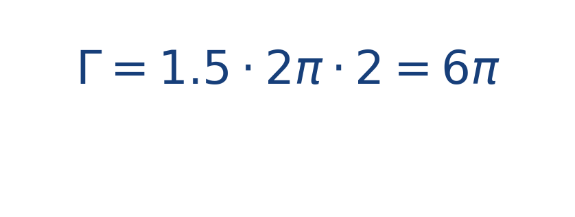

## Ejercicio guiado moderado

**Problema.** Un campo tangencial de magnitud constante [[MATHIMG:math/inline_b44acc9bae28.png|1.5]] recorre una circunferencia de radio [[MATHIMG:math/inline_1491219e76f6.png|2]].

**Resultado.**

> La circulación aumenta si crece la rapidez tangencial o si el contorno es más grande.

## Interpretación

El objetivo del ejercicio no es solo obtener el número final, sino leer qué significa físicamente o geométricamente dentro del tema. Ese paso de interpretación es el que conecta la cuenta con la simulación del taller.
