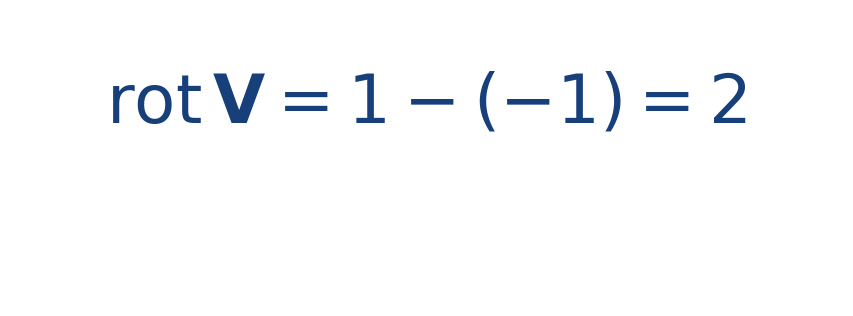

## Ejercicio guiado moderado

**Problema.** Para [[MATHIMG:math/inline_6257f9e3d1be.png|\mathbf{V}(x,y)=(-y,x)]], calcula el rotor escalar en 2D.

**Resultado.**

> El resultado positivo indica giro local antihorario.

## Interpretación

El objetivo del ejercicio no es solo obtener el número final, sino leer qué significa físicamente o geométricamente dentro del tema. Ese paso de interpretación es el que conecta la cuenta con la simulación del taller.
