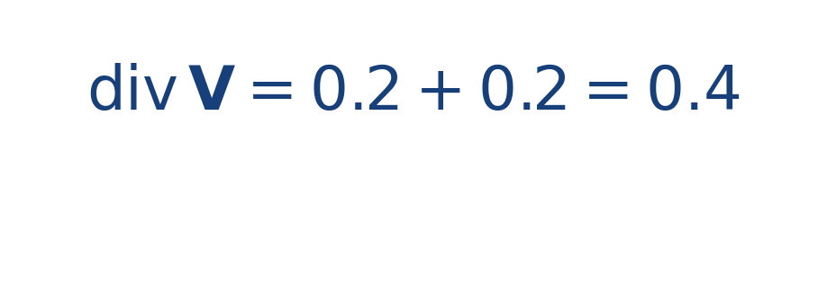

## Idea central

La divergencia indica si un campo se comporta localmente como una fuente o como un sumidero. Si es positiva, el flujo tiende a salir; si es negativa, tiende a entrar.

Es una medida local: no describe todo el campo, sino lo que ocurre cerca de un punto.

No se trata de una propiedad “de todo el dibujo” de una sola vez, sino de una medida local. Por eso el mismo campo puede comportarse de manera distinta según la región que observes.

## Ejercicio resuelto

**Problema.** Para [[MATHIMG:math/inline_c4a832c9c999.png|\mathbf{V}(x,y)=(0.2x,0.2y)]], calcula la divergencia.

**Solución.**

Como el resultado es positivo, el campo se comporta como una fuente.

## Qué observar en la simulación

Mira un campo radial saliente: las flechas parecen separarse del centro. Esa expansión visual se relaciona con divergencia positiva.

## Dónde se usa

La divergencia aparece en fluidos, electromagnetismo, transferencia de masa y formulaciones locales de leyes de conservación.
