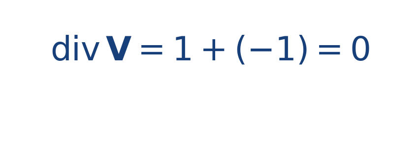

## Ejercicio guiado moderado

**Problema.** Para el campo [[MATHIMG:math/inline_bbc65251c100.png|\mathbf{V}(x,y)=(x,-y)]], calcula la divergencia.

**Resultado.**

> No hay creación neta ni destrucción local de flujo en ese punto de vista.

## Interpretación

El objetivo del ejercicio no es solo obtener el número final, sino leer qué significa físicamente o geométricamente dentro del tema. Ese paso de interpretación es el que conecta la cuenta con la simulación del taller.
