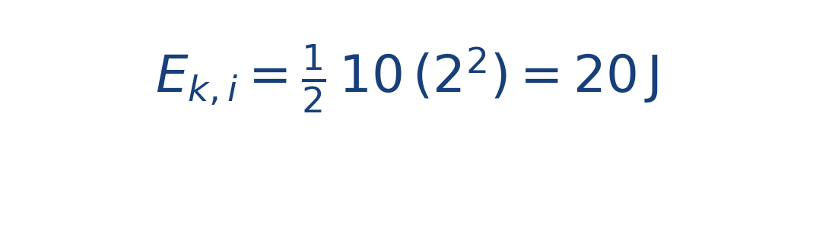
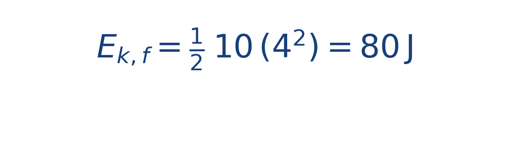
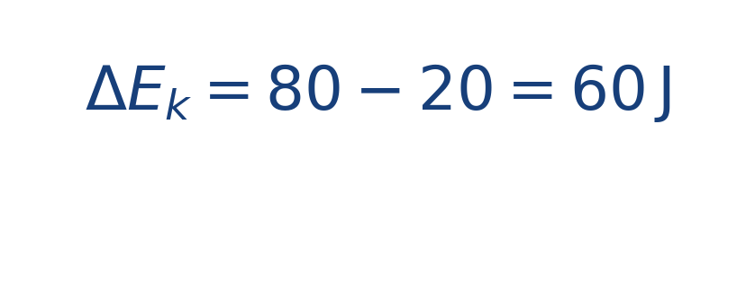

## Idea central

La energía cinética mide cuánta energía tiene el bote por moverse. El trabajo mide cuánta energía transfieren las fuerzas al sistema durante un desplazamiento.

Cuando el trabajo neto es positivo, la energía cinética aumenta.

Pensar en términos de energía ayuda mucho cuando las fuerzas cambian a lo largo de la ruta. En vez de seguir cada detalle local, puedes estudiar cuánto trabajo acumulado se convirtió en rapidez.

## Ejercicio resuelto

**Problema.** Un bote de [[MATHIMG:math/inline_86911872ecf0.png|10\,\text{kg}]] pasa de [[MATHIMG:math/inline_265fb103c2b6.png|2\,\text{m/s}]] a [[MATHIMG:math/inline_06b1853bace6.png|4\,\text{m/s}]].

**Solución.** La energía inicial es

La energía final es

Por tanto,

## Qué observar en la simulación

Aumenta el empuje y nota cómo el bote gana velocidad. Ese aumento se refleja en la energía cinética mostrada en los resultados.

## Dónde se usa

Se usa en mecánica clásica, diseño de máquinas, dinámica vehicular y análisis energético de procesos físicos.
