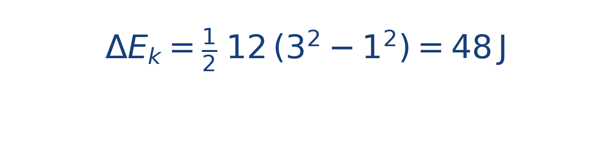

## Ejercicio guiado moderado

**Problema.** Una lancha de [[MATHIMG:math/inline_70db0b58c46a.png|12\,\text{kg}]] aumenta su rapidez de [[MATHIMG:math/inline_f58e007e6465.png|1\,\text{m/s}]] a [[MATHIMG:math/inline_1534382b77f9.png|3\,\text{m/s}]].

**Resultado.**

> Si no hay pérdidas, ese cambio de energía coincide con el trabajo neto realizado.

## Interpretación

El objetivo del ejercicio no es solo obtener el número final, sino leer qué significa físicamente o geométricamente dentro del tema. Ese paso de interpretación es el que conecta la cuenta con la simulación del taller.
