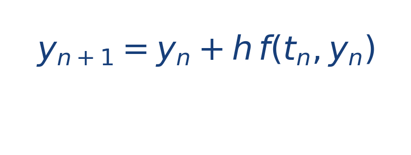
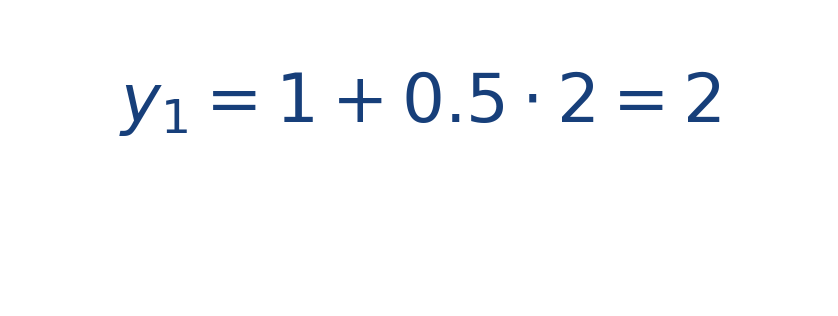
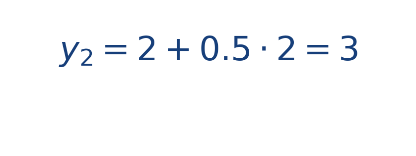

## Idea central

Euler toma la pendiente actual y supone que esa tendencia se mantiene durante un intervalo corto [[MATHIMG:math/inline_6e9356ec0bd2.png|h]]. Es el método más directo para avanzar una EDO en el tiempo.

Su valor didáctico es enorme: muestra con claridad cómo un algoritmo numérico convierte una derivada en una secuencia de aproximaciones.

Su principal virtud es que hace visible la mecánica interna del algoritmo. Ves la pendiente, avanzas un paso y corriges en el siguiente. Su principal limitación es que, si el paso es grande o el sistema cambia rápido, el error se acumula con facilidad.

## Ejercicio resuelto

**Problema.** Aproxima la solución de [[MATHIMG:math/inline_9c555466d438.png|y'=2]] con [[MATHIMG:math/inline_7130510c630d.png|y(0)=1]] y paso [[MATHIMG:math/inline_b9ee7a9743bb.png|h=0.5]] hasta [[MATHIMG:math/inline_e61619bb5913.png|t=1]].

**Solución.** Aplicamos

Primer paso:

Segundo paso:

La aproximación en [[MATHIMG:math/inline_e61619bb5913.png|t=1]] es [[MATHIMG:math/inline_bc5db59a6e49.png|y(1)\approx 3]].

## Qué observar en la simulación

Reduce el paso temporal y compara la trayectoria. Cuando [[MATHIMG:math/inline_6e9356ec0bd2.png|h]] es menor, el error acumulado suele disminuir.

## Dónde se usa

Euler se usa con fines didácticos, prototipos rápidos y como primera aproximación en cursos de métodos numéricos y simulación física.
