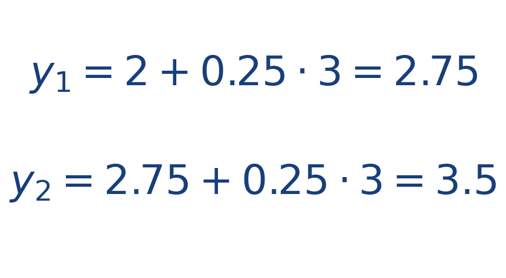

## Ejercicio guiado moderado

**Problema.** Usa Euler para aproximar la solución de [[MATHIMG:math/inline_51ee4069f4f7.png|y'=3]] con [[MATHIMG:math/inline_72b46b4ece3d.png|y(0)=2]], paso [[MATHIMG:math/inline_5d0a38a28dee.png|h=0.25]] y dos iteraciones.

**Resultado.**

> Cada paso suma la pendiente actual multiplicada por el tamaño del paso.

## Interpretación

El objetivo del ejercicio no es solo obtener el número final, sino leer qué significa físicamente o geométricamente dentro del tema. Ese paso de interpretación es el que conecta la cuenta con la simulación del taller.
