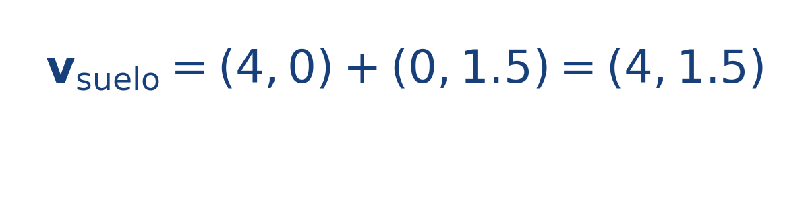
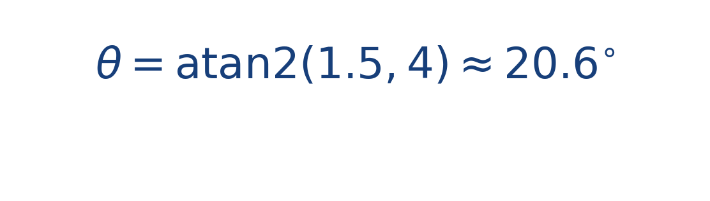

## Idea central

La composición vectorial une una lectura geométrica y una lectura física. Geométricamente suma flechas; físicamente combina causas simultáneas del movimiento.

Por eso orientar la proa en una dirección no garantiza avanzar exactamente en esa misma dirección cuando existe corriente cruzada.

En ingeniería, descomponer y recomponer vectores evita errores conceptuales frecuentes. Un bote puede apuntar hacia un lado y aun así desplazarse hacia otro si el medio lo arrastra con suficiente intensidad.

## Ejercicio resuelto

**Problema.** Un bote tiene velocidad propia [[MATHIMG:math/inline_f330888633ab.png|\mathbf{v}_r=(4,0)\,\text{m/s}]] y la corriente vale [[MATHIMG:math/inline_4e3b559fae84.png|\mathbf{V}=(0,1.5)\,\text{m/s}]].

**Solución.** La velocidad respecto al suelo es

El ángulo de deriva se obtiene con

## Qué observar en la simulación

Busca casos en los que la traza del bote no coincida con su orientación inicial. Ahí aparece de forma clara la suma vectorial real.

## Dónde se usa

Este razonamiento aparece en mecánica clásica, navegación, dinámica de vehículos y análisis vectorial de fuerzas en ingeniería.
