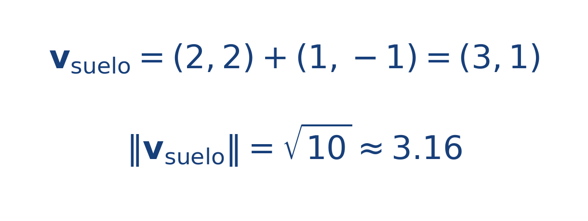

## Ejercicio guiado moderado

**Problema.** Una lancha tiene velocidad propia [[MATHIMG:math/inline_21a47f706b59.png|\mathbf{v}_p=(2,2)\,\text{m/s}]] y la corriente aporta [[MATHIMG:math/inline_8e02ca67a629.png|\mathbf{V}=(1,-1)\,\text{m/s}]].

1. Calcula la velocidad total.
2. Calcula su rapidez.
3. Indica si la corriente reduce o aumenta la componente vertical.

**Resultado.**

> La componente vertical sigue siendo positiva, pero la corriente la reduce.

## Interpretación

El objetivo del ejercicio no es solo obtener el número final, sino leer qué significa físicamente o geométricamente dentro del tema. Ese paso de interpretación es el que conecta la cuenta con la simulación del taller.
