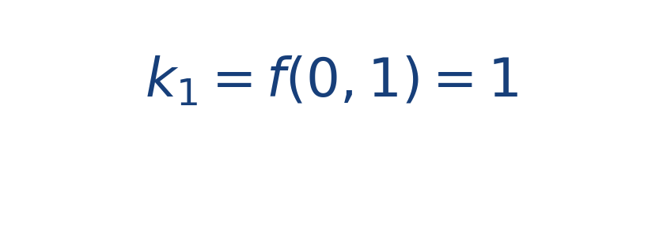
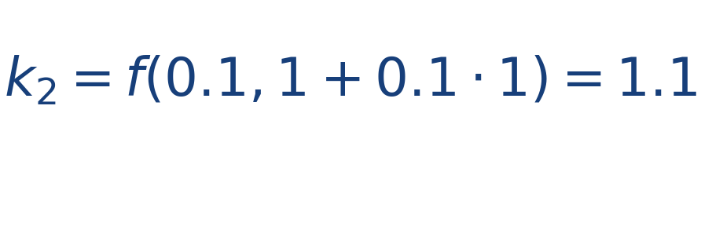
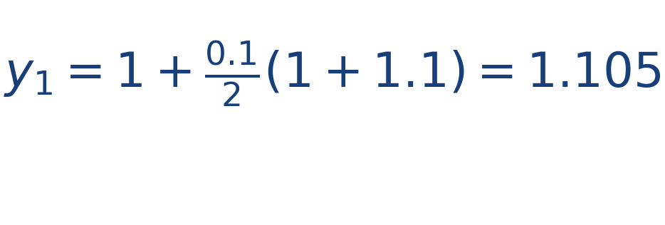

## Idea central

Heun corrige el paso de Euler usando un promedio entre la pendiente inicial y una pendiente estimada al final del intervalo. Por eso se conoce como Euler mejorado.

El método sigue siendo simple, pero ya introduce la idea de predicción y corrección.

La intuición física es valiosa: si la pendiente cambia dentro del paso, conviene no quedarse con una sola fotografía local. Heun mejora precisamente eso al usar una predicción y una corrección ligera.

## Ejercicio resuelto

**Problema.** Para [[MATHIMG:math/inline_fdfc2c1eb32a.png|y'=y]], [[MATHIMG:math/inline_7130510c630d.png|y(0)=1]] y [[MATHIMG:math/inline_b2be435b8352.png|h=0.1]], calcula un paso de Heun.

**Solución.** Primero,

Luego estimamos la pendiente final:

Ahora corregimos:

## Qué observar en la simulación

Compara el resultado de Heun con Euler usando el mismo paso. Heun suele desviarse menos de la curva esperada.

## Dónde se usa

Es común en cursos de análisis numérico, simulación de sistemas dinámicos y comparación de integradores de orden bajo.
