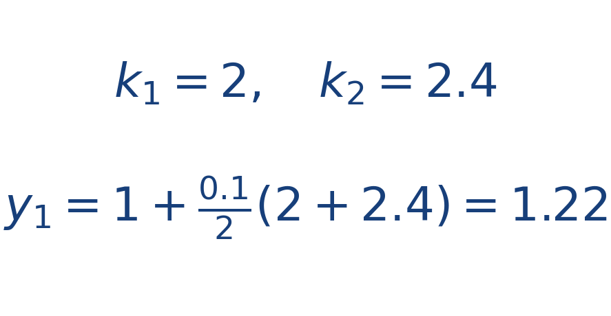

## Ejercicio guiado moderado

**Problema.** Aplica un paso de Heun a [[MATHIMG:math/inline_091af907cba8.png|y'=2y]], [[MATHIMG:math/inline_7130510c630d.png|y(0)=1]] con [[MATHIMG:math/inline_b2be435b8352.png|h=0.1]].

**Resultado.**

> Heun corrige el exceso o defecto de Euler promediando dos pendientes.

## Interpretación

El objetivo del ejercicio no es solo obtener el número final, sino leer qué significa físicamente o geométricamente dentro del tema. Ese paso de interpretación es el que conecta la cuenta con la simulación del taller.
