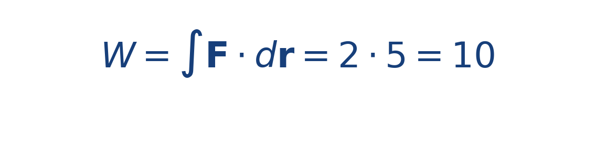

## Idea central

La integral de línea acumula el efecto del campo a lo largo de una trayectoria. En este contexto sirve para medir trabajo o energía transferida durante un recorrido.

No basta con saber el campo en un punto: importa también por dónde se mueve el sistema.

Aquí la trayectoria importa tanto como el campo. Cambiar el camino puede cambiar el trabajo total, incluso si los puntos inicial y final son los mismos.

## Ejercicio resuelto

**Problema.** En un campo uniforme [[MATHIMG:math/inline_25555f2927a4.png|\mathbf{F}=(2,0)]], mueve el bote desde [[MATHIMG:math/inline_26c0ef502f75.png|(0,0)]] hasta [[MATHIMG:math/inline_22f11eb9206f.png|(5,0)]].

**Solución.** Como la trayectoria es horizontal y la fuerza apunta en la misma dirección,

Si el desplazamiento fuera vertical, el producto punto sería cero y el trabajo también sería cero.

## Qué observar en la simulación

Compara una trayectoria alineada con la corriente con otra perpendicular. El efecto acumulado del campo cambia mucho.

## Dónde se usa

Se usa en mecánica, electromagnetismo, fluidos y cálculo vectorial cuando interesa el efecto acumulado a lo largo de una ruta.
