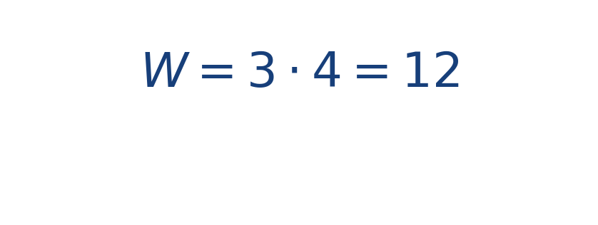

## Ejercicio guiado moderado

**Problema.** En un campo constante [[MATHIMG:math/inline_77847b85d066.png|\mathbf{F}=(3,0)]], calcula el trabajo al mover una partícula de [[MATHIMG:math/inline_94d007dd3349.png|(1,0)]] a [[MATHIMG:math/inline_22f11eb9206f.png|(5,0)]].

**Resultado.**

> Solo cuenta la parte del desplazamiento alineada con la fuerza.

## Interpretación

El objetivo del ejercicio no es solo obtener el número final, sino leer qué significa físicamente o geométricamente dentro del tema. Ese paso de interpretación es el que conecta la cuenta con la simulación del taller.
