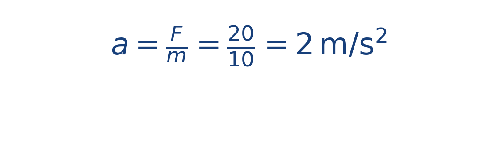
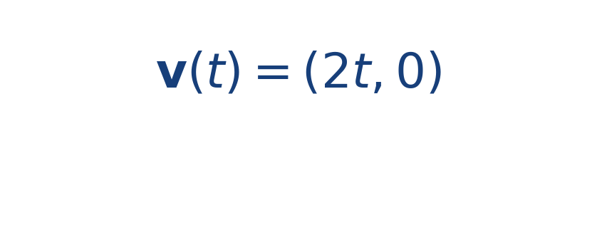
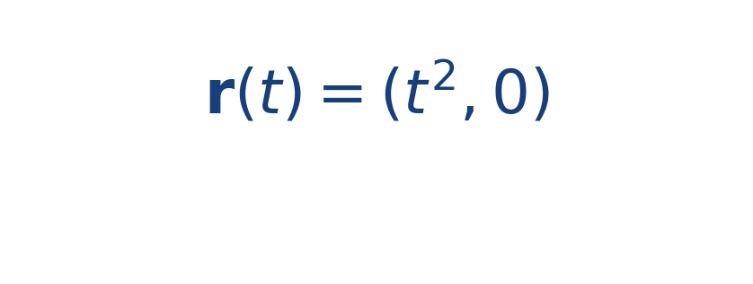

## Idea central

Una ecuación diferencial ordinaria describe cómo cambia una magnitud con el tiempo. En navegación puede representar posición, velocidad o aceleración cuando el sistema evoluciona paso a paso.

En este proyecto las EDO aparecen cuando el estado del bote se actualiza a partir de fuerzas y velocidades.

Cuando trabajas con EDO, lo importante no es memorizar una forma cerrada en todos los casos, sino entender qué significa la derivada dentro del fenómeno. Si la derivada de la posición es la velocidad y la derivada de la velocidad depende de la fuerza total, entonces cada paso del simulador tiene una interpretación física clara.

## Ejercicio resuelto

**Problema.** Una lancha de masa [[MATHIMG:math/inline_86911872ecf0.png|10\,\text{kg}]] recibe una fuerza neta constante [[MATHIMG:math/inline_99ef9ae25404.png|\mathbf{F}=(20,0)\,\text{N}]] y parte del reposo.

**Solución.** Por segunda ley de Newton,

Entonces la velocidad evoluciona como

Y la posición, si [[MATHIMG:math/inline_053143a9ff95.png|\mathbf{r}(0)=(0,0)]], queda

## Qué observar en la simulación

Cuando la fuerza es constante, la separación entre puntos sucesivos de la trayectoria crece con el tiempo. Esa es la huella visual de la aceleración.

## Dónde se usa

Las EDO se usan en mecánica, control, dinámica de vehículos, robótica y modelado de sistemas físicos donde el estado evoluciona en el tiempo.
