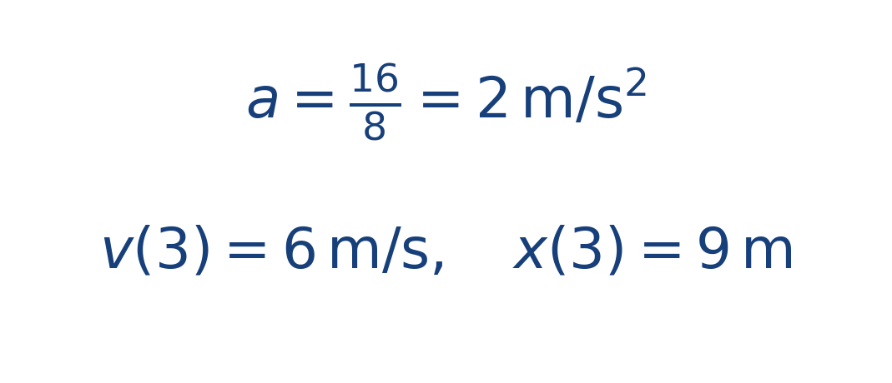

## Ejercicio guiado moderado

**Problema.** Un bote de masa [[MATHIMG:math/inline_f56a6a6bb171.png|8\,\text{kg}]] recibe una fuerza neta horizontal de [[MATHIMG:math/inline_deb4cad9a084.png|16\,\text{N}]] y parte del reposo.

1. Calcula la aceleración.
2. Calcula la velocidad a los [[MATHIMG:math/inline_c9b2690e4c3e.png|3\,\text{s}]].
3. Calcula la posición horizontal recorrida en ese tiempo.

**Resultado.**

> La posición crece cuadráticamente porque la velocidad aumenta de forma lineal.

## Interpretación

El objetivo del ejercicio no es solo obtener el número final, sino leer qué significa físicamente o geométricamente dentro del tema. Ese paso de interpretación es el que conecta la cuenta con la simulación del taller.
