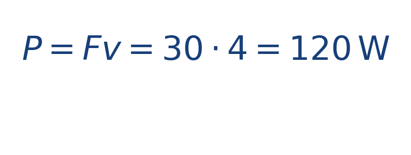
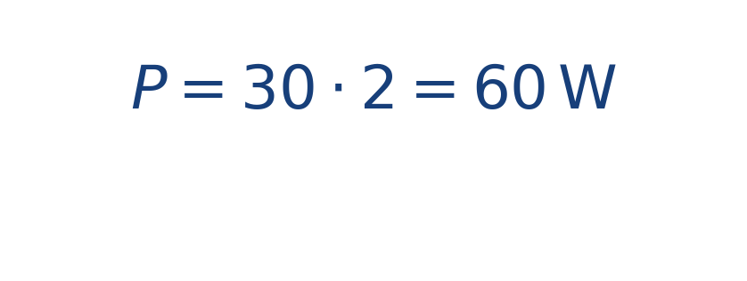

## Idea central

La potencia indica qué tan rápido se transfiere energía. No solo importa cuánto empuja el motor, sino también con qué velocidad logra mover el bote.

Por eso dos situaciones con la misma fuerza pueden tener potencias distintas si la rapidez cambia.

La idea clave es que una fuerza grande a baja velocidad puede entregar menos potencia que una fuerza moderada a alta velocidad. Por eso fuerza y potencia no son sinónimos, aunque estén relacionadas.

## Ejercicio resuelto

**Problema.** El motor entrega una fuerza de [[MATHIMG:math/inline_b5db26898b31.png|30\,\text{N}]] en la dirección del movimiento y el bote navega a [[MATHIMG:math/inline_06b1853bace6.png|4\,\text{m/s}]].

**Solución.** La potencia es

Si la velocidad baja a [[MATHIMG:math/inline_265fb103c2b6.png|2\,\text{m/s}]] con la misma fuerza, entonces

## Qué observar en la simulación

Compara escenarios con igual empuje y distinta velocidad. Verás que la potencia cambia aunque la fuerza aplicada sea la misma.

## Dónde se usa

Este concepto se usa en motores, propulsión naval, mecánica aplicada y análisis de eficiencia en sistemas de transporte.
