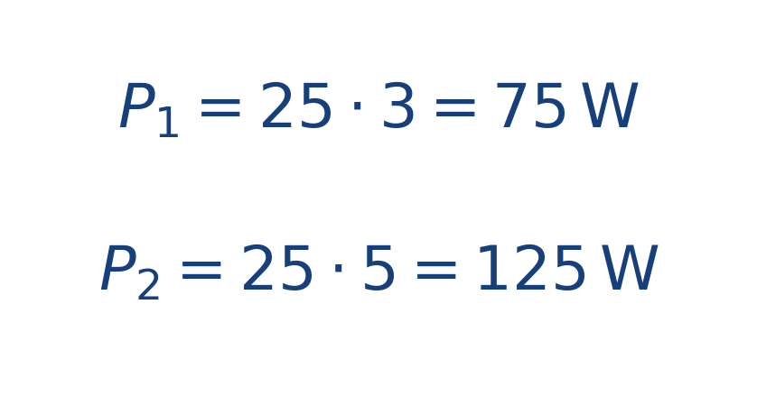

## Ejercicio guiado moderado

**Problema.** Un motor sostiene una fuerza de [[MATHIMG:math/inline_da37b3e9d94b.png|25\,\text{N}]] y el bote avanza a [[MATHIMG:math/inline_1534382b77f9.png|3\,\text{m/s}]].

1. Calcula la potencia.
2. Repite si la velocidad sube a [[MATHIMG:math/inline_65427dcc93e4.png|5\,\text{m/s}]].

**Resultado.**

> Con la misma fuerza, la potencia crece linealmente con la velocidad.

## Interpretación

El objetivo del ejercicio no es solo obtener el número final, sino leer qué significa físicamente o geométricamente dentro del tema. Ese paso de interpretación es el que conecta la cuenta con la simulación del taller.
