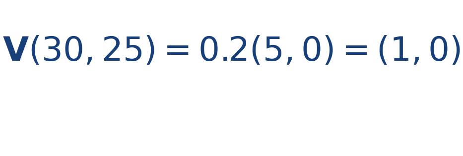
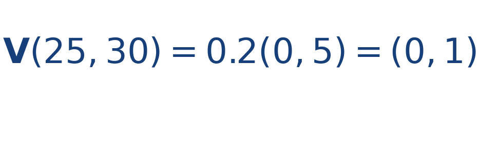

## Idea central

Un campo radial apunta alejándose del centro o acercándose a él. Puede modelar una fuente, un sumidero o una región donde la corriente empuja hacia fuera.

Su dirección depende de la posición relativa al centro y su magnitud suele crecer con la distancia.

Lo importante no es solo ver que las flechas salen o entran, sino notar cómo la dirección depende de la posición relativa al centro. Esa dependencia espacial es la esencia del campo.

## Ejercicio resuelto

**Problema.** Con centro en [[MATHIMG:math/inline_ec49e049c292.png|(25,25)]] y [[MATHIMG:math/inline_3289e14d0e92.png|k=0.2]], calcula el campo en [[MATHIMG:math/inline_cd2ea0e21ac1.png|(30,25)]] y en [[MATHIMG:math/inline_e56086da6a2e.png|(25,30)]].

**Solución.** En [[MATHIMG:math/inline_cd2ea0e21ac1.png|(30,25)]],

En [[MATHIMG:math/inline_e56086da6a2e.png|(25,30)]],

Los vectores apuntan alejándose del centro, como corresponde a una fuente radial.

## Qué observar en la simulación

Mueve el bote alrededor del centro y compara cómo cambia la dirección de la corriente sin perder la simetría radial.

## Dónde se usa

Se usa en introducciones a fluidos, electrostática, gravedad idealizada y análisis geométrico de fuentes y sumideros.
