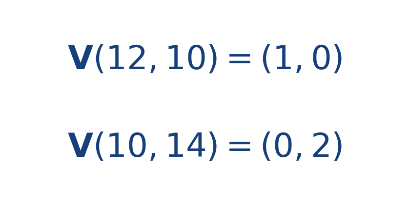

## Ejercicio guiado moderado

**Problema.** En un campo radial con centro [[MATHIMG:math/inline_b26f1ea6a051.png|(10,10)]] y [[MATHIMG:math/inline_d1bacc107445.png|k=0.5]], calcula el vector de campo en [[MATHIMG:math/inline_0e68b28c2180.png|(12,10)]] y en [[MATHIMG:math/inline_89c73a672a29.png|(10,14)]].

**Resultado.**

> La dirección siempre se aleja del centro cuando [[MATHIMG:math/inline_96d8fa3ccd63.png|k>0]].

## Interpretación

El objetivo del ejercicio no es solo obtener el número final, sino leer qué significa físicamente o geométricamente dentro del tema. Ese paso de interpretación es el que conecta la cuenta con la simulación del taller.
