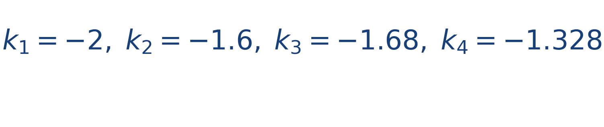
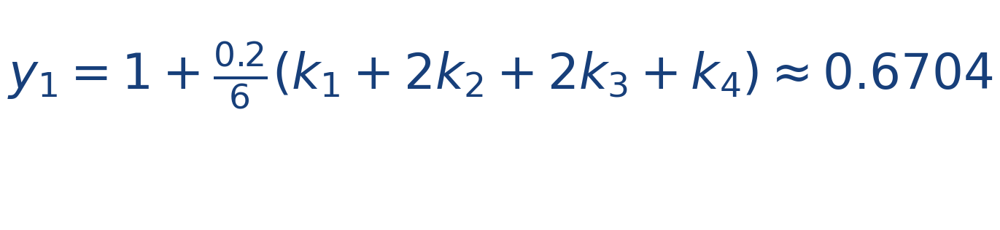

## Idea central

Runge-Kutta de orden 4 combina cuatro pendientes dentro del mismo paso. Es más costoso que Euler o Heun, pero normalmente ofrece mucha mejor precisión.

En simulación es un clásico porque logra buen equilibrio entre costo computacional y calidad numérica.

Para el estudiante, RK4 es importante porque enseña una idea profunda: una sola pendiente rara vez resume bien todo un intervalo. Tomar muestras intermedias permite capturar mejor la curvatura real de la solución.

## Ejercicio resuelto

**Problema.** Para [[MATHIMG:math/inline_3a45ceb96cb8.png|y'=-2y]], [[MATHIMG:math/inline_7130510c630d.png|y(0)=1]] y [[MATHIMG:math/inline_505a7eed41f2.png|h=0.2]], calcula el primer paso de RK4.

**Solución.** Las pendientes son

Entonces

## Qué observar en la simulación

Usa RK4 en un escenario donde la trayectoria sea curva. Notarás que la ruta numérica suele verse más suave y estable.

## Dónde se usa

Se usa mucho en simulación científica, dinámica clásica, electrónica, control y software educativo que requiere buena precisión con un método estándar.
