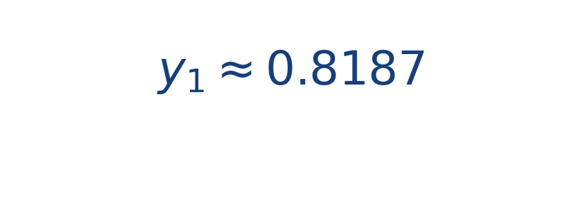

## Ejercicio guiado moderado

**Problema.** Para [[MATHIMG:math/inline_b2fc7e46e60c.png|y'=-y]], [[MATHIMG:math/inline_7130510c630d.png|y(0)=1]] y [[MATHIMG:math/inline_505a7eed41f2.png|h=0.2]], calcula el primer paso con RK4.

**Resultado aproximado.**

> El valor coincide muy bien con la solución exacta [[MATHIMG:math/inline_12be7c74680c.png|e^{-0.2}]].

## Interpretación

El objetivo del ejercicio no es solo obtener el número final, sino leer qué significa físicamente o geométricamente dentro del tema. Ese paso de interpretación es el que conecta la cuenta con la simulación del taller.
