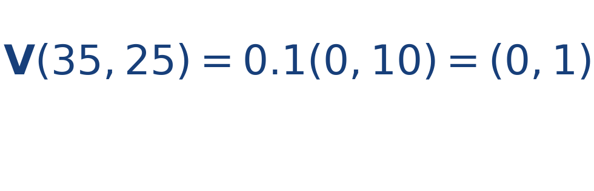
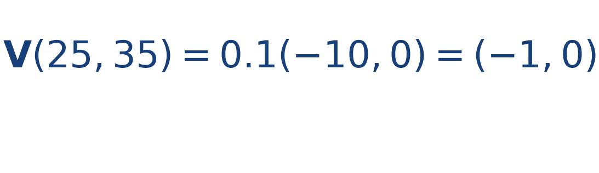

## Idea central

Un campo rotacional hace que las trayectorias tiendan a curvarse alrededor de un centro. Es la idealización matemática de un remolino.

Aquí la dirección del vector es tangencial a la circunferencia centrada en el vórtice.

Aquí la intuición geométrica es muy poderosa: la flecha no apunta hacia el centro, sino tangencialmente al giro. Por eso el movimiento resultante se curva en vez de entrar directamente.

## Ejercicio resuelto

**Problema.** Con centro en [[MATHIMG:math/inline_ec49e049c292.png|(25,25)]] y [[MATHIMG:math/inline_fd668c0af35e.png|\omega=0.1]], calcula el campo en [[MATHIMG:math/inline_6236bf8699df.png|(35,25)]] y en [[MATHIMG:math/inline_800d88b88a6a.png|(25,35)]].

**Solución.** En [[MATHIMG:math/inline_6236bf8699df.png|(35,25)]],

En [[MATHIMG:math/inline_800d88b88a6a.png|(25,35)]],

## Qué observar en la simulación

Carga un remolino y verifica que la trayectoria tienda a girar alrededor del centro en vez de escapar radialmente.

## Dónde se usa

Este patrón aparece en fluidos, meteorología simplificada, dinámica planar y estudios introductorios de vorticidad.
