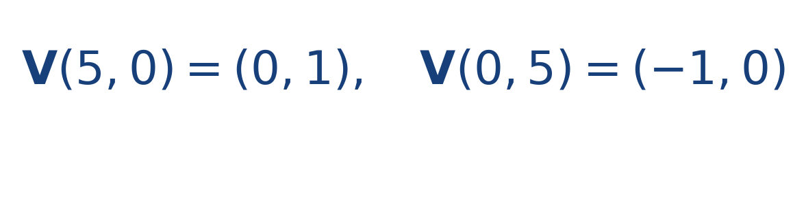

## Ejercicio guiado moderado

**Problema.** En un campo rotacional con centro [[MATHIMG:math/inline_26c0ef502f75.png|(0,0)]] y [[MATHIMG:math/inline_1c27d7436327.png|\omega=0.2]], calcula el vector en [[MATHIMG:math/inline_22f11eb9206f.png|(5,0)]] y en [[MATHIMG:math/inline_e704ed125308.png|(0,5)]].

**Resultado.**

> El campo es tangencial a la circunferencia centrada en el vórtice.

## Interpretación

El objetivo del ejercicio no es solo obtener el número final, sino leer qué significa físicamente o geométricamente dentro del tema. Ese paso de interpretación es el que conecta la cuenta con la simulación del taller.
