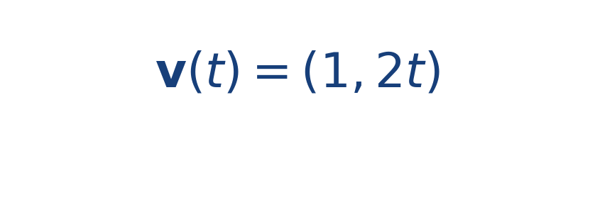

## Idea central

Una curva paramétrica describe la posición mediante un parámetro, casi siempre el tiempo. En simulación es natural trabajar así porque la trayectoria se recorre paso a paso.

Separar [[MATHIMG:math/inline_214097a35e9c.png|x(t)]] y [[MATHIMG:math/inline_511bdf53a4c8.png|y(t)]] ayuda a entender cómo crece cada componente del movimiento.

El valor de una parametrización es que no solo dice dónde está la partícula, sino en qué orden pasa por cada punto. Eso es crucial cuando quieres distinguir trayectorias que comparten forma pero no dinámica.

## Ejercicio resuelto

**Problema.** Considera la trayectoria

**Solución.** Para [[MATHIMG:math/inline_e61619bb5913.png|t=1]] el punto es [[MATHIMG:math/inline_6afb4202409b.png|(1,1)]] y para [[MATHIMG:math/inline_71c763f03339.png|t=2]] es [[MATHIMG:math/inline_b9d589876749.png|(2,4)]].

La velocidad paramétrica resulta

En [[MATHIMG:math/inline_e61619bb5913.png|t=1]], la tangente tiene dirección [[MATHIMG:math/inline_57f7dc7f3efb.png|(1,2)]], así que la curva ya está inclinándose hacia arriba.

## Qué observar en la simulación

Fíjate en cómo la trayectoria cambia aunque el movimiento horizontal sea uniforme. La parte vertical puede crecer más rápido y curvar la ruta.

## Dónde se usa

Este lenguaje aparece en geometría, cinemática, robótica móvil, gráficos por computadora y planeación de movimiento.
