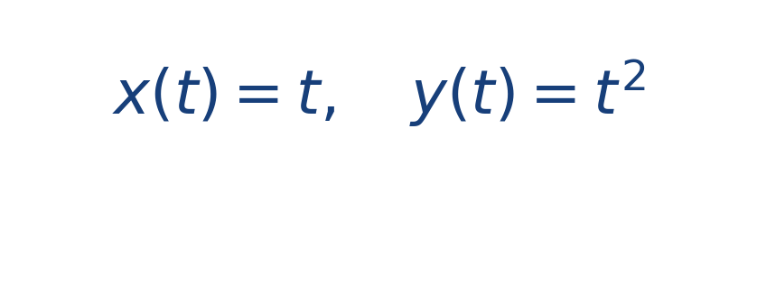
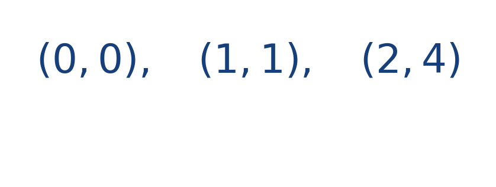

## Ejercicio guiado moderado

**Problema.** Una trayectoria está dada por

Calcula los puntos para [[MATHIMG:math/inline_3c0a4c38435f.png|t=0]], [[MATHIMG:math/inline_e61619bb5913.png|t=1]] y [[MATHIMG:math/inline_71c763f03339.png|t=2]].

**Resultado.**

> La componente horizontal crece linealmente y la vertical crece más rápido, por eso la curva se abre hacia arriba.

## Interpretación

El objetivo del ejercicio no es solo obtener el número final, sino leer qué significa físicamente o geométricamente dentro del tema. Ese paso de interpretación es el que conecta la cuenta con la simulación del taller.
