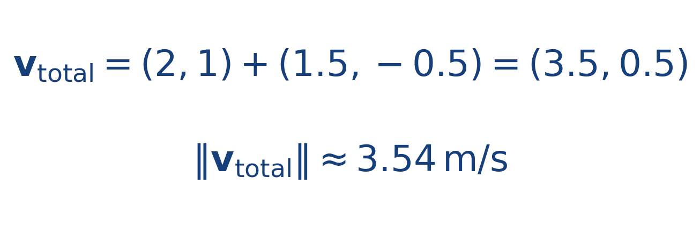

## Ejercicio guiado moderado

**Problema.** En un punto del plano la corriente vale [[MATHIMG:math/inline_9e7b5e5ce0be.png|\mathbf{V}=(1.5,-0.5)\,\text{m/s}]] y la embarcación genera respecto al agua una velocidad propia [[MATHIMG:math/inline_72494bec4628.png|\mathbf{v}_p=(2,1)\,\text{m/s}]].

1. Calcula la velocidad total respecto al suelo.
2. Calcula su rapidez.
3. Indica si la corriente desvía al bote hacia arriba o hacia abajo.

**Resultado.**

> La componente vertical sigue siendo positiva, pero queda reducida por la corriente.

## Interpretación

El objetivo del ejercicio no es solo obtener el número final, sino leer qué significa físicamente o geométricamente dentro del tema. Ese paso de interpretación es el que conecta la cuenta con la simulación del taller.
